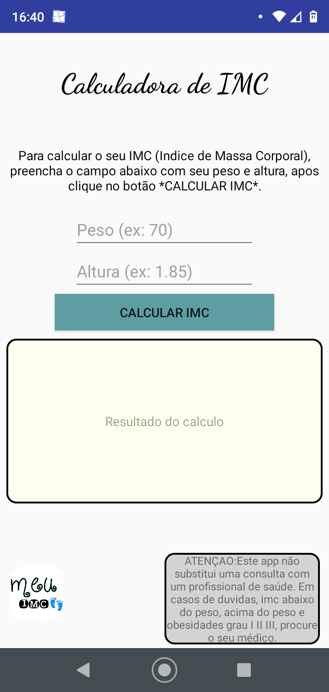
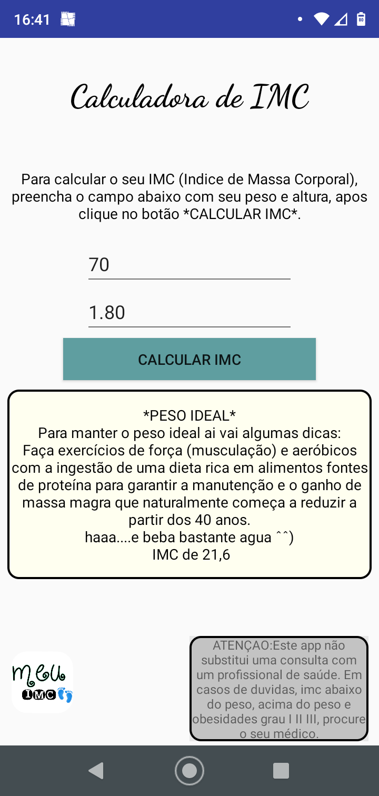

# Calculadora-de-IMC

## Uma simples calculadora de IMC (Indice de Massa Corporal), na linguagem java, criada no meu celular motog7 😁 . 

### Como ja havia criado o app ***calculadora***  antes (o projeto dela esta aqui no meu github também), foi mais tranquilo fazer esse de IMC.

### Algumas fotos do app:

----

### O logo também foi criado e personalizado com um ótimo app disponível na Play Store. Ele cria logos redondos, quadrados, quadrados com bordas arredondadas e etc. Eu super indico 👍🏻

----

Imagem do logo:

App criador de logos disponivel na Play Store:

----

## Estou somente com um pequeno detalhe que esta me incomodando neste app......no Edit text altura gostaria que o ponto (ou virgula) fosse automatico quando o usuario estivesse digitando, porem ja pesquisei bastante e não encontrei algo sobre. Se você souber como fazer e quiser ajudar uma garota que esta engatinhando ainda na programação, ficarei muito contente rsrs. 
Meu e-mail para contato: ruth09@yahoo.com  😊
